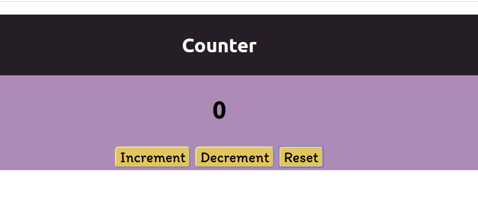

# To Do List Web-Application

http://mycounterproject.surge.sh/
### *A Counter Web App that increments, decrements and resets counter.*

## Task
Built this app to practice and polish my HTML5, CSS3, Javascript-es6 and React Skills.

## Functionality
 - Increment Counter
 - Decrement Counter
 - Reset Counter

## Run Locally 

- Run this command `git clone https://github.com/qjunaid623/counter/`
- You are now in the dev environment and you can play around 

## Tech Stack

- HTML5
- CSS3
- Javascript ES6
- React
- React Hooks
- VS Code
- Surge
- Github Actions
